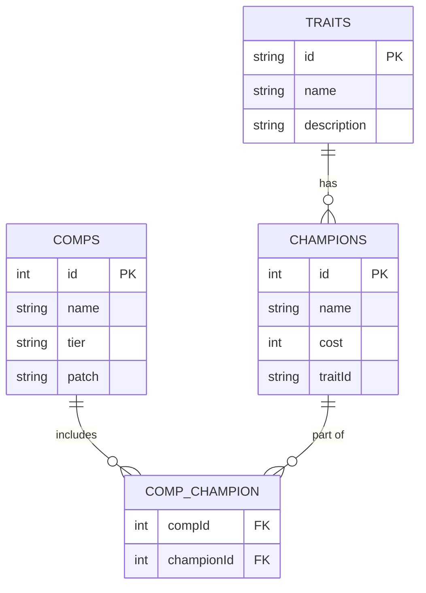

```mermaid
erDiagram
  CHAMPIONS {
    int id PK
    string name
    int cost
    string traitId
  }

  TRAITS {
    string id PK
    string name
    string description
  }

  COMPS {
    int id PK
    string name
    string tier
    string patch
  }

  COMP_CHAMPION {
    int compId FK
    int championId FK
  }

  TRAITS ||--o{ CHAMPIONS : "has"
  COMPS ||--o{ COMP_CHAMPION : "includes"
  CHAMPIONS ||--o{ COMP_CHAMPION : "part of"
```